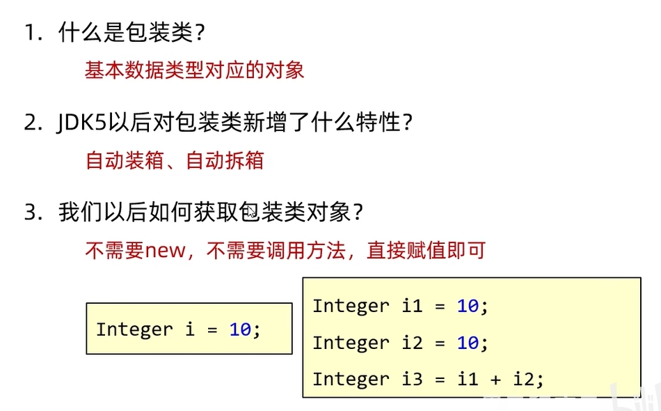
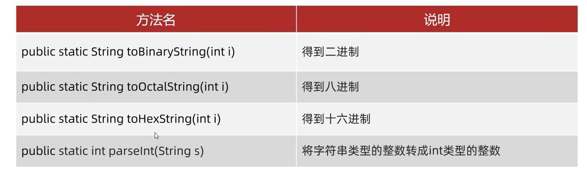
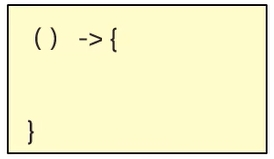

# Java基础

## 抽象类

```java
public abstract class Person {

    public abstract void work();
}
```

##### 抽象类不能实例化

##### 抽象类中可有、可不有抽象方法

##### 可以有构造方法

##### 抽象类子类

​	要么重写抽象类中所有的抽象方法

​	要么是抽象类

## 接口

### 接口的定义和使用

#### 接口用interface定义

public interface 接口名{}

#### 接口不能实例化

#### 接口与类之间是实现关系，通过implements关键字表示

public class 类名 implements 接口名 {}

#### 接口的子类（实现类）

要么重写接口中的所有抽象方法

要么是抽象类

#### 注意

接口和类的关系，可以单实现，也可以多实现

public class 类名 implements 接口名1 ， 接口名2{}

实现类还可以在继承一个类的同时实现多个接口

public class 类名 extends 父类 implements 接口名1 ， 接口名2{}

### 接口中成员的特点

#### 成员变量

只能是常量

默认修饰符：public static final

#### 构造方法

没有

#### 成员方法

默认修饰符：public abstract

JDK7 : 接口只能定义抽象方法

JDK8 : 接口可以定义有方法体的方法 （默认、静态）

JDK9 : 接口可以定义私有方法

### 接口和类的关系

#### 类和类的关系

继承关系，只能单继承，不能多继承，但可以多层继承

#### 类和接口的关系

实现关系，可以单实现，可以多实现，一个类可以继承一个类的同时实现多借口

#### 接口和接口的关系

继承关系，可以单继承，也可以多继承

实现类实现最下面的子接口，就需要重写所有的抽象方法

### JDK9新增的方法

#### 格式一：private  返回值类型 方法名（）{}

给默认方法服务

#### 格式二：private static 返回值类型 方法名（）{}

给静态方法服务的

### 接口的应用

接口代表规则，是行为的抽象

当一个方法的参数是接口，可以传递该接口所有实现类的对象（接口多态）

### 适配器设计模式

实现类和接口之间的第三者，当一个接口中抽象方法过多，但是我只使用其中一部分的时候，用适配器设计模式

#### 书写步骤

编写中间类XXXAdapter，实现对应的接口

对接口中的抽象方法进行空实现

让真正的实现类继承中间类，并重写需要用的方法

为避免其他类创建适配器类的对象，中间的适配器类用abstract进行修饰

## 内部类

类的五大成员：属性、方法、构造方法、代码块、内部类

在一个类的里面，再定义一个类

### 内部类特点

内部类可以直接访问外部类的成员，包括私有

外部类要访问内部类的成员，必须创建对象

### 成员内部类

写在成员位置的，属于外部类的成员

可以被一些修饰符修饰，private ,默认、protected，public，static

### 静态内部类

静态内部类只能访问外部类中的静态变量和静态方法，如果想要访问非静态的需要创建对象。

#### 创建静态内部类对象的格式

外部类名.内部类名 对象名 = new 外部类名.内部类名();

#### 创建非静态方法的格式

先创建对象用对象调用

#### 调用静态方法的格式

外部类名.内部类名.方法名();

### 局部内部类

将内部类定义在方法里面就叫局部内部类，类似于方法里面的局部变量

外界是无法直接使用局部内部类，需要在方法内部创建对象并使用

该类可以直接访问外部类的成员，也可以访问方法内的局部变量

### 匿名内部类

#### 概述

匿名内部类本质上就是隐藏了名字的内部类

#### 格式

new 类名或者接口名() {

​	重写方法；

}

包含三部分：继承  重写  创建对象

#### 什么是匿名内部类

隐藏了名字的内部类，可以在成员位置，也可以在局部位置

#### 使用场景

当方法的参数是接口或者类，

以接口为例，可以传递这个接口实现的实现类对象

如一个实现类只使用一次，就可使用其简化代码

## 常用API

### JDK7前时间相关类

#### Date 时间

##### 空参构造

表示当前的时间 Date date = new Date();

##### 有参构造

表示指定的时间 Date date = new Date(指定毫秒值)；

##### setTime(毫秒值)；

##### getTime(毫秒值);

#### SimpleDateFormat 格式化时间


#### Calendar 日历

### JDK8新增时间相关类

### 包装类



#### 什么是包装类

基本数据类型对应的引用类型（对象）

#### 获取包装类

利用构造方法：

Integer i = new Integer(1);

##### valueOf获取：

在-128~127 创建好了，直接获取，范围之外new

#### Integer成员方法



#### 类型转换：

8种包装类中，除Character 其他都有对应的parseInt方法

#### 接收数据

统一使用nextLine，遇到回车才停止 可以接受（123 123 ......)

#### Lambda表达式

##### 标准格式



（）方法形参

-> 固定格式

{} 对应方法的方法体

##### 注意点

Lambda表达式可以用来简化匿名内部类书写

Lambda表达式只能简化函数式几口的匿名内部类的写法

函数式接口：有且仅有一个抽象方法的


