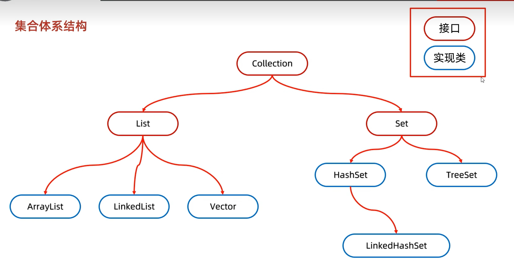
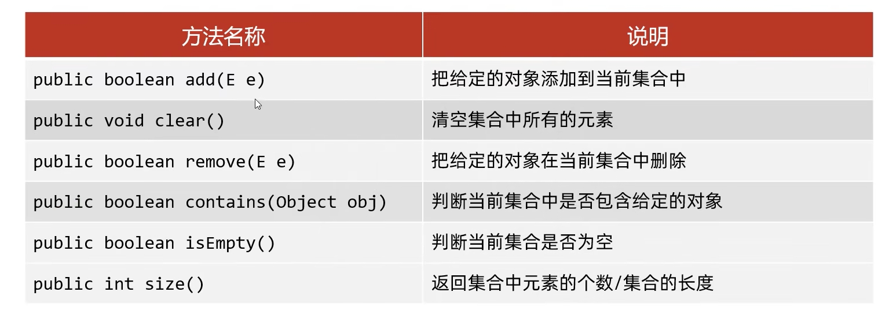
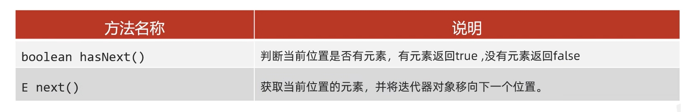
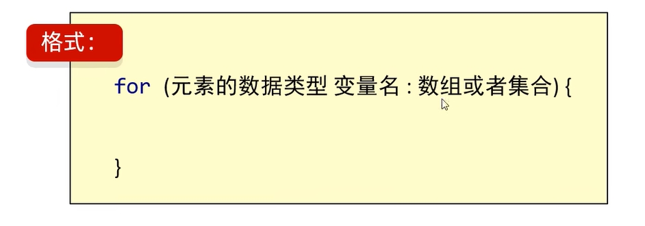
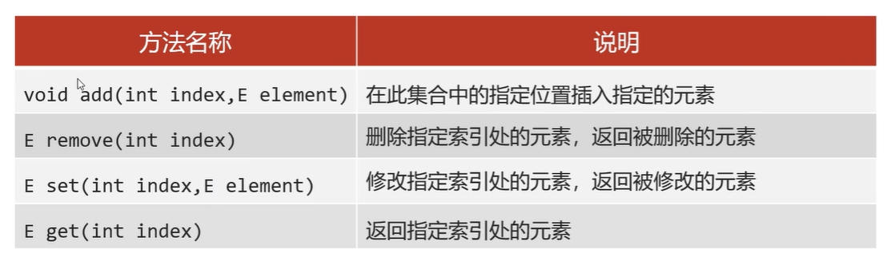

# 集合体系结构



## 单列集合——Collection

单列集合的祖宗接口



### 迭代器遍历

迭代器是集合专用的遍历方法，如果需要删除元素，使用迭代器

```java
    public static void main(String[] args) {
        Collection<String> coll = new ArrayList<>();
        coll.add("aaa");
        coll.add("bbb");
        coll.add("ccc");

        Iterator<String> it = coll.iterator();
        while (it.hasNext()){
            //next方法做两件事：获取元素并移动指针
            String str = it.next();
            System.out.println(str);
        }
    }
}
```

1.报错NoSuchElementException

2.迭代器遍历完成，指针不会复位

3.循环中只能用一次next方法

4.迭代器遍历时，不能用集合的方法进行增加或者删除

### 增强for遍历

1.增强for的底层逻辑就是迭代器

JDK5之后出现的

所有的单列集合和数据才能用增强for进行遍历

#### 格式



修改增强for中的变量，不会改变集合中原本的数据

### lambda表达式遍历

```java
public class CollectionDemo04 {
    public static void main(String[] args) {
        // 创建集合并添加元素
        Collection<String> coll = new ArrayList<>();
        coll.add("zhangsan");
        coll.add("lisi");
        coll.add("wangwu");
        // 利用匿名内部类的方式
        /*coll.forEach(new Consumer<String>() {
            @Override
            //s依次表示集合中的每一个数据
            public void accept(String s) {
                System.out.println(s);
            }
        });*/
        // lambda表达式
        coll.forEach(s->
            System.out.println(s)
        );
    }
}
```

### List

添加元素是**有序的**、**可重复**、**有索引**

有序：存取顺序一样

有索引：可以通过索引操作元素

#### List集合特有的方法



#### 遍历方式

迭代器遍历：遍历过程中删除元素

列表迭代器：遍历过程中需要添加元素

增强for遍历：仅仅遍历

Lambda遍历：仅仅遍历

普通for循环：遍历的时候想操作索引，可以用普通的for

#### ArrayList

##### 底层原理（扩容机制）

1.利用空参创建的集合，在底层创建一个默认长度为0的数组

2.添加第一个元素时，底层会创建一个新的长度为10的数组

3.存满时，会扩容1.5倍

4.如果一次添加多个元素，1.5倍还放不下，则新创建数组的长度以实际长度为准

#### LinkedList

#### Vector

### Set

添加元素是**无序**、**不重复**、**无索引**

